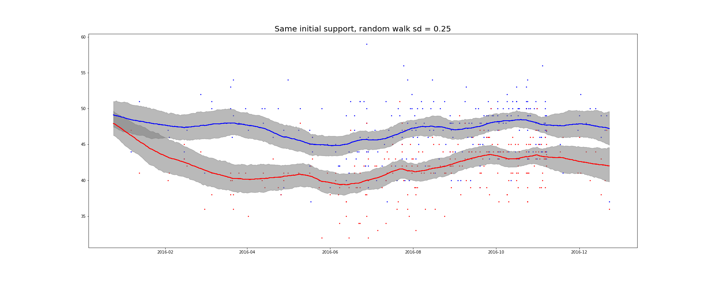
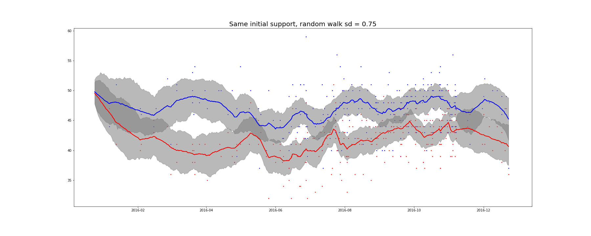

# polling_model_py
State space model for aggregating poll data

This is a modified version of a state space model developed for Python 2: 
https://github.com/eliflab/polling_model_py

that itself was based on an R implementation:
https://statmodeling.stat.columbia.edu/2016/08/06/state-space-poll-averaging-model/

This version makes a couple of modifications:

### 1 There's no scraping. 
The data is already downloaded.
### 2 The standard deviation of the random walk is now an argument. 
If the analyst feels that public sentiment changes more rapidly, then the parameter can be changed. A larger standard deviation of the random walk will make the true value more jumpy. Below is an image with a standard deviation of 0.25:

upping the standard deviation to 0.75 makes the mean significantly more variable day-to-day:

The attractive aspects of this model are that no matter the prior (i.e. the initial belief about each candidate's support) the ratings eventually cross. So even if the original approval rating is way off, the data eventually dominates. Additionally, the uncertainty about each day's approval is empirically derived from the Stan simulations. A bigger standard deviation leads to a larger window of uncertainty. 

####To do:
+ Make the standard deviation of the day-to-day a parameter to be estimated
